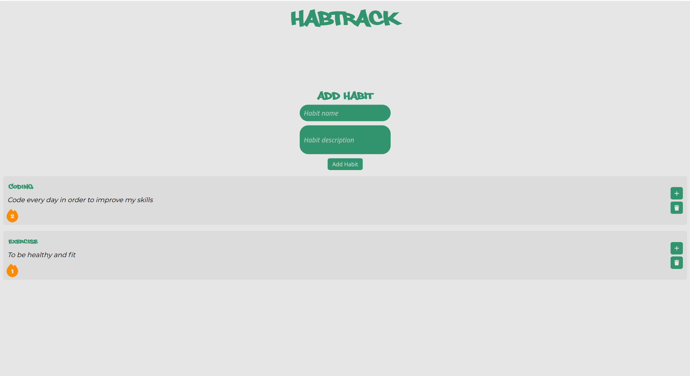

# HabTrack

A web application built with Flask in which users can track daily habits by adding and increasing their streaks.



## Tech Stack
- Python (Flask)
- HTML5, CSS3
- MYSQL

## Features
- View, Add, and Delete habits
- Increase your streak in order to track your habit everyday
- Lose streak after 3 days if streak not increased

## Installation
```bash
git clone https://github.com/justincox8/HabTrack
cd HabTrack
pip install -r requirements.txt
flask run
```
### Demo
TBD


